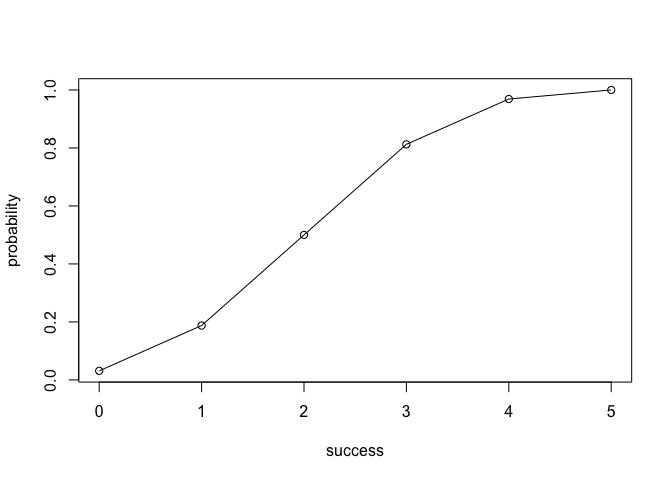

<!-- README.md is generated from README.Rmd. Please edit that file -->
Overview
--------

`"binomial"` is a minimal [R](http://www.r-project.org/) package that provides functions for calculating probabilities of a Binomial random variable, and related calculatiion such as the probability distribution, the expected values, variance, etc.

-   `bin_choose` function calculates the number of combinations in which k successes can occur in n trials.
-   `bin_probability` function calculates the probability of getting successes in trials with probability prob per trial.
-   `bin_distribution` function calculates the probability distribution.
-   `bin_cumulative` function calculates the cumulative distribution.
-   `bin_variable` functions shows the information about variables.

Motivation
----------

This package has been developed to illustrate some of the concepts behind the creation of an R package.

Installation
------------

Install the development version from GitHub via the package `"devtools"`:

``` r
# development version from GitHub:
# install.packages("devtools") 
# install "binomial" (without vignettes)
devtools::install_github("stat133-sp19/hw-stat133-AliceQiuhy/binomial")
# install "binomial" (with vignettes)
devtools::install_github("stat133-sp19/hw-stat133-AliceQiuhy/binomial", build_vignettes = TRUE)
```

Usage
-----

``` r
library(binomial)

## bin_choose
bin_choose(n = 5, k = 2)
#> [1] 10

#bin_probability
bin_probability(2,5,0.5)
#> [1] 0.3125

#bin_distribution
dis1 <- bin_distribution(trials = 5, prob = 0.5)
dis1
#>   success probability
#> 1       0     0.03125
#> 2       1     0.15625
#> 3       2     0.31250
#> 4       3     0.31250
#> 5       4     0.15625
#> 6       5     0.03125
plot(dis1)
```


``` r

#bin_distribution
dis2 <- bin_cumulative(trials = 5, prob = 0.5)
dis2
#>   success probability cumulative
#> 1       0     0.03125    0.03125
#> 2       1     0.15625    0.18750
#> 3       2     0.31250    0.50000
#> 4       3     0.31250    0.81250
#> 5       4     0.15625    0.96875
#> 6       5     0.03125    1.00000
plot(dis2)
```



``` r

#bin_variable
bin1 <- bin_variable(trials = 10, p = 0.3)
bin1
#> "Binomial variable"
#> 
#> Parameters
#> - number of trials: 10 
#> - prob of success : 0.3
binsum1 <- summary(bin1)
binsum1
#> "Binomial variable"
#> 
#> Parameters
#> - number of trials: 10 
#> - prob of success : 0.3 
#> 
#> Measures
#> - mean    : 3 
#> - variance: 2.1 
#> - mode    : 3 
#> - skewness: 0.2760262 
#> - kurtosis: -0.1238095
```
